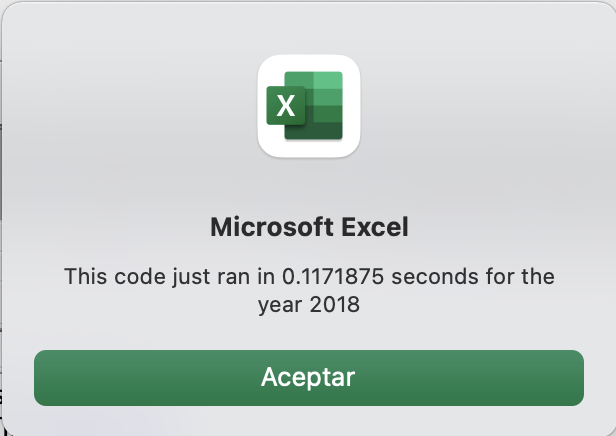

# Stock Analysis
## Overview of Project

### Purpose
The main purpose for the second module of the Boot camp is to analyze the stock data for differents tickers in 2017 and 2018, so we can find **Total Daily Voume** and **Return**. The second purpose is to refactor the Module 2 solution code in order to have a better performance and reduce execution time.  

### Background
During the second module we learned how to use VBA in order to create macros that will make Excel tasks easier. In this case we created macros to help Steve and his parents analyze stock data. However, the code created didn't have the best performance in time because it loops through all the stock data multiple times (we have two different for loops which made our code very complex).  

    

  

It took up to 46 seconds in order to finish its execution. 

    

  

    

## Results  
We have to make the same analysis in less steps, that is refactoring it to make it more efficient. That is reason why we added three different arrays, in order to to store the information that we need from the first for loop and we can get rid of the second for loop. 

  

  

  

  
This change in the code will reduce time considerably. 

  

    

  

   

Now we can appreciate the result of each execution.  
 

  

  

  

 

## Summary
 
- What are the advantages or disadvantages of refactoring code?  
Refactoring code has many advantages: it improves the understanding that you have of your code, it helps finding bugs, sometimes it improves the performance. However it takes time (that sometimes you don't have) and requires a higher thinking level and patience. You need to decide prior if refactoring the code worth it.  
- How do these pros and cons apply to refactoring the original VBA script?
In this case refactoring the original VBA script results in a considerable reduction in execution time (from 46 seconds to nearly 1 second), also it helps in a better understanding of for loops and arrays. 

